<h1>Compte Rendu : "Full Banking Project"</h1>
<h2>Partie 1 : Front-End</h2>
<h3>la liste des produits :</h3>
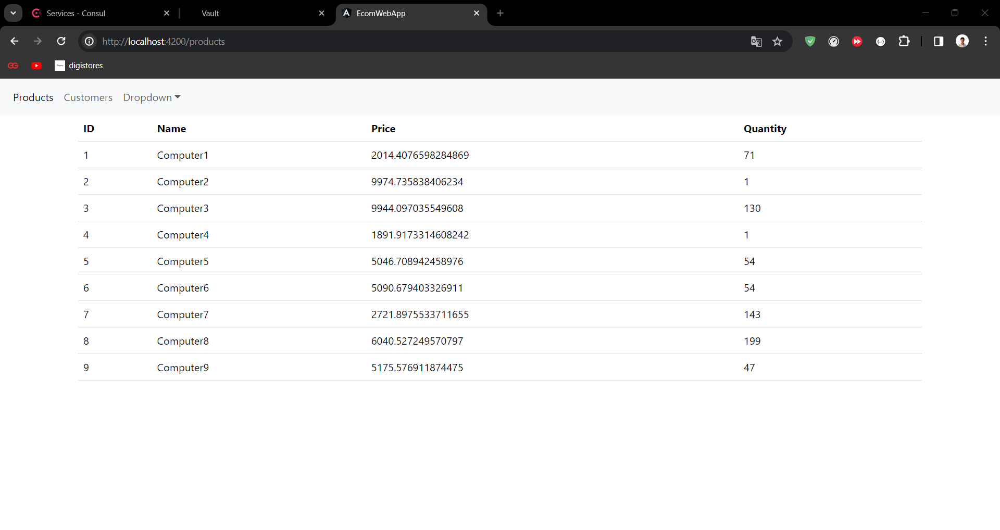
<h3>la liste des clients :</h3>
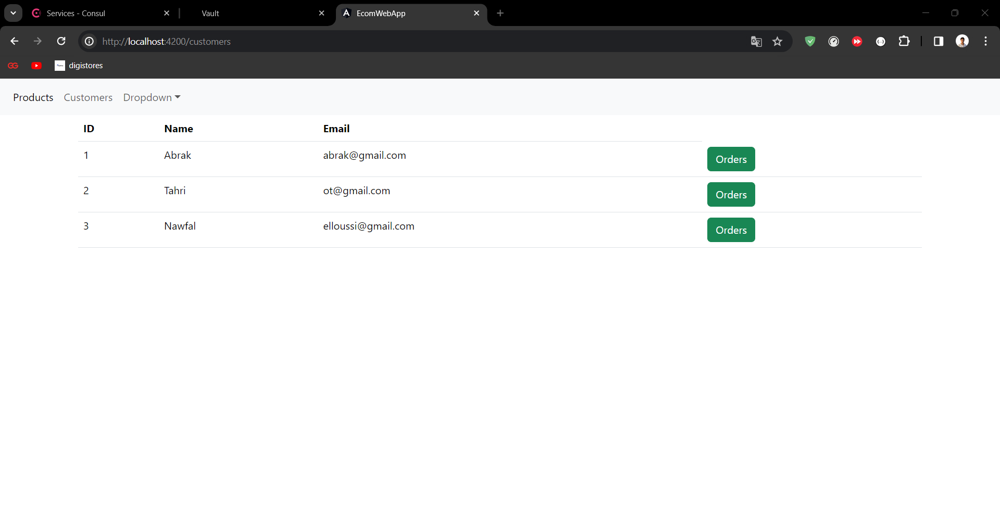
<h3>Chaque client contient une liste des ordres (bouton vert):</h3>
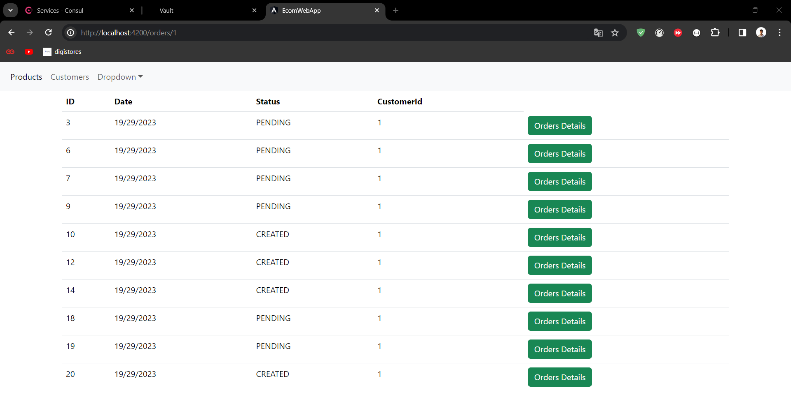
<h3>Cette page contient les details de chaque ordre</h3>
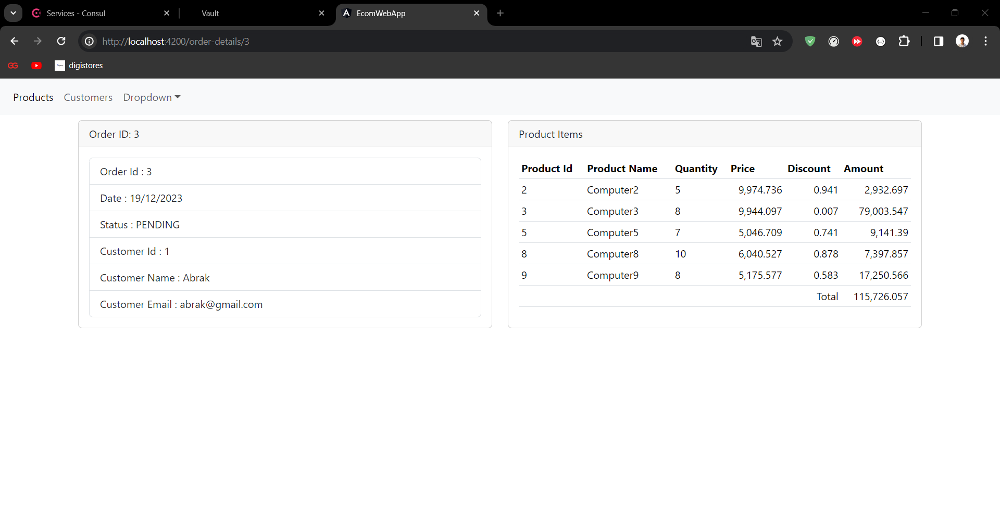
<h3>Pour configurer CORS dans la gateway-service</h3>
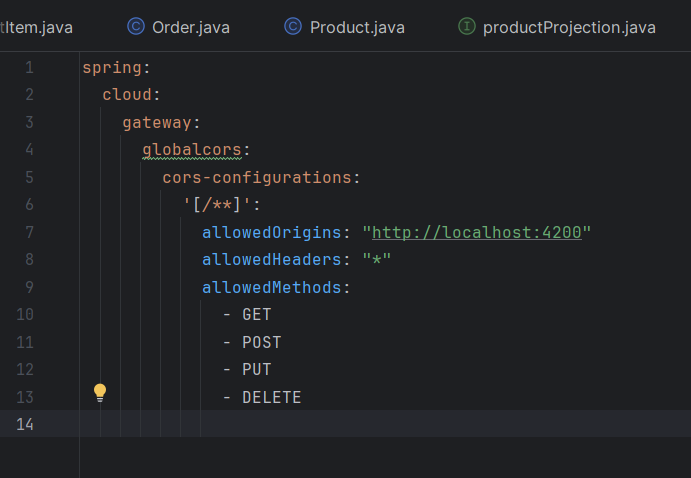
<h2>Partie 2: Back-End</h2>
<h3>Les services sont enregistrés dans Consul :</h3>
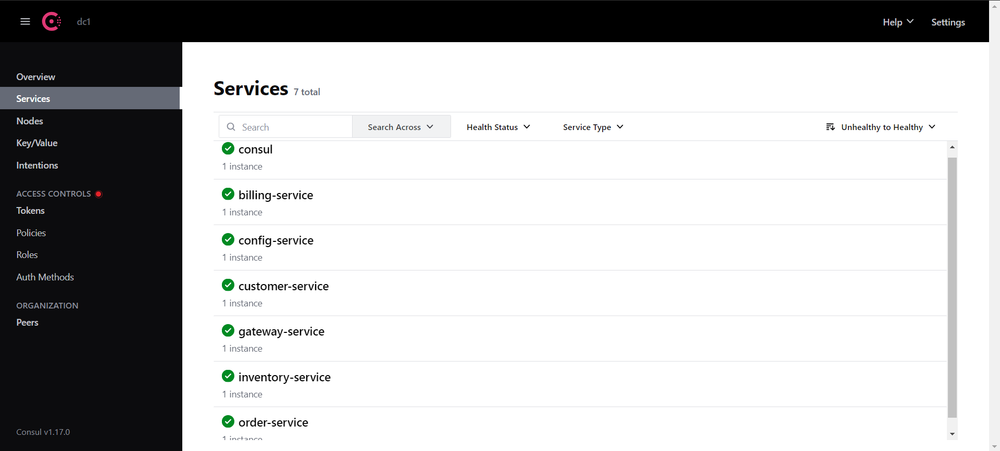
<h3>1)-Consul Config</h3>

Pour utiliser Concul Config il faut tout d'abord ajouter la dependance suivante :

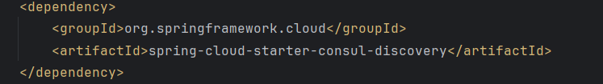

L'interface Concul où on a enregistrer notre configuration :

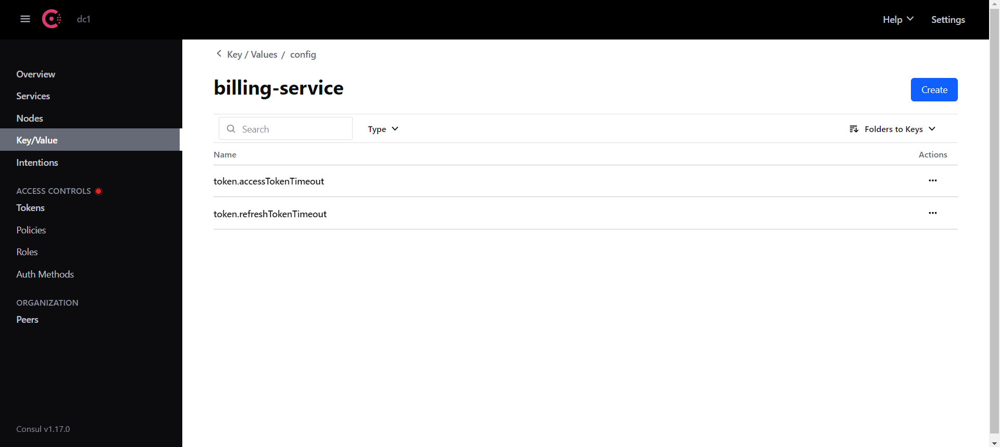

Pour utiliser la configuration dans chaque microservice on doit l'importer :

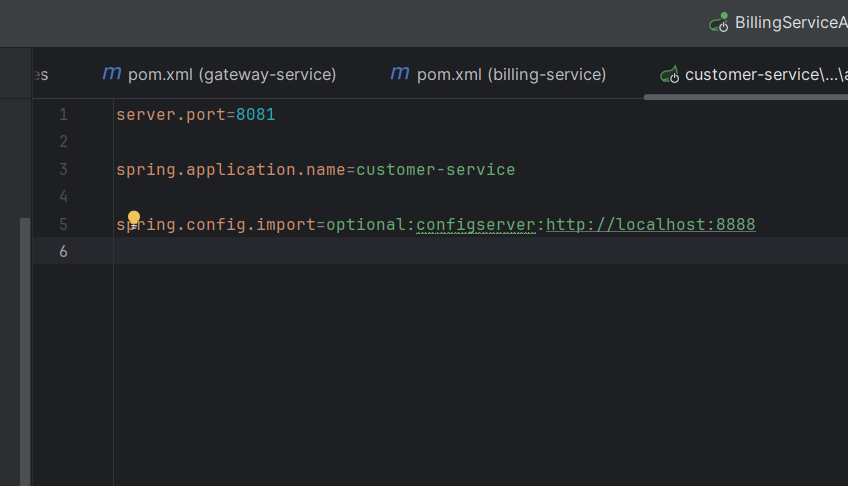
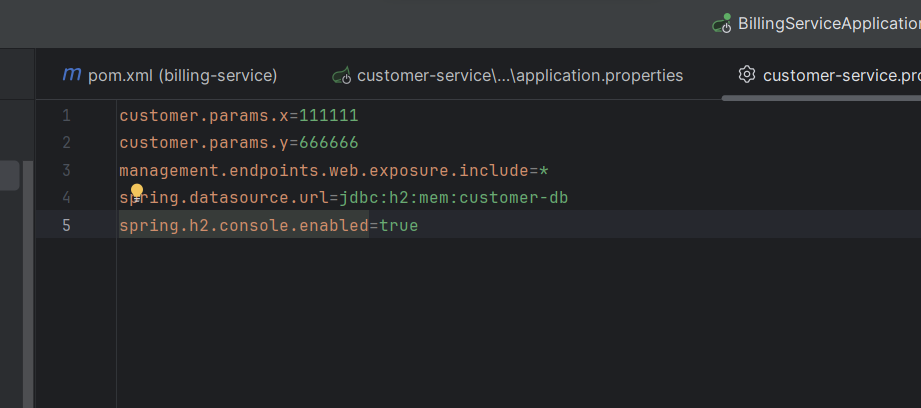

Et pour tester si la config est bien importé on utilise une class RestController

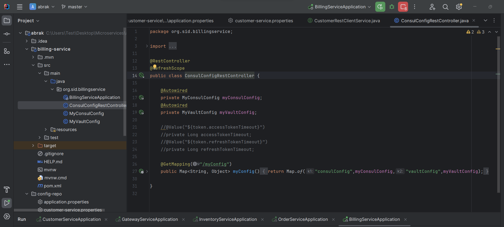
<h3>2) Vault Config</h3>

Pour utiliser Vault Config il faut tout d'abord ajouter la dependance suivante :

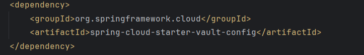

L'interface Vault où on a enregistrer notre configuration :

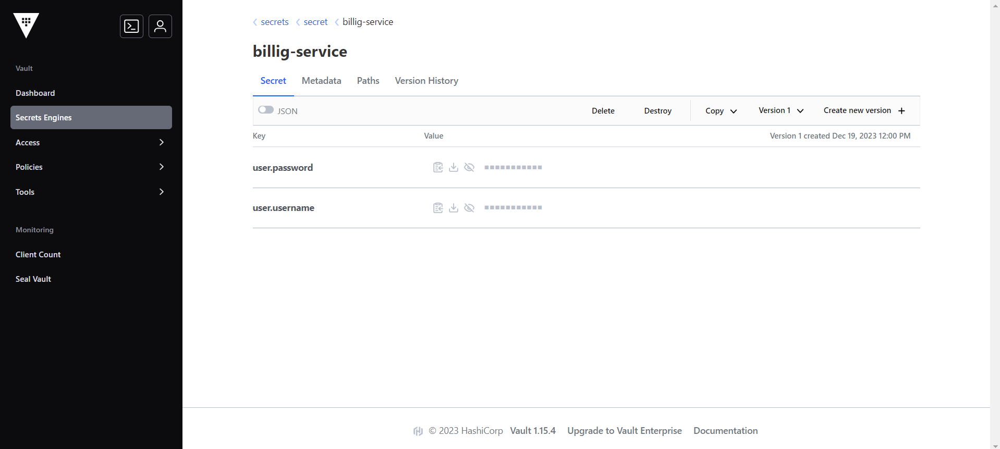

Pour utiliser la configuration dans chaque microservice on doit la configurer et l'importer :

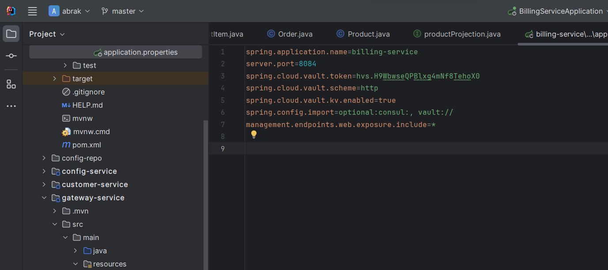

Et pour tester si la config est bien importé on utilise une class RestController

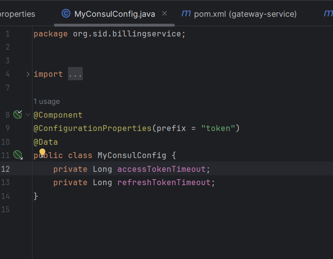
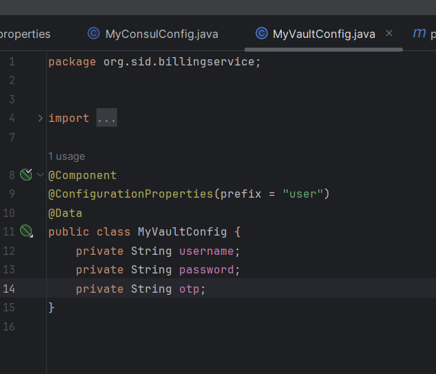
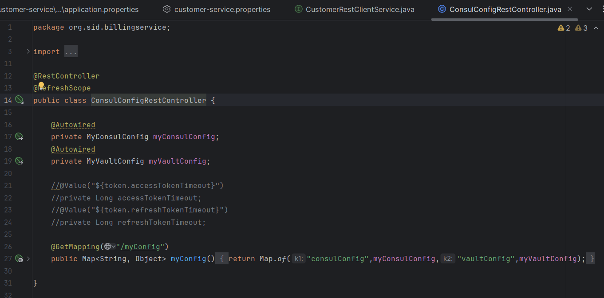
